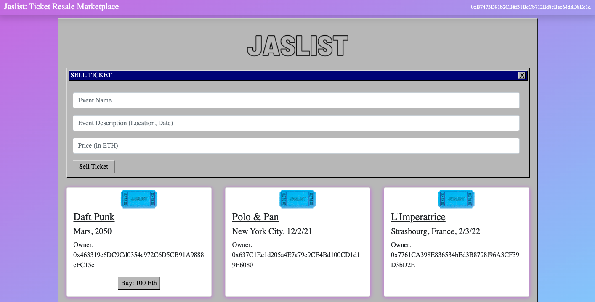

# Jaslist Ticket Marketplace dApp


## Overview
### Problem
Second-hand ticket exchanges (for concerts, events, shows, etc.) are vulnerable to scams because the buyer or the seller is not a trusted source. Tickets need to be validated for their authenticity and promised that they aren't duplicated. Funds from the buyer need to be validated. 

### Solution
Jaslist Ticket Marketplace dApp will allow users to buy or sell tickets and can engage in transactions where the ticket and money exchange are verified on the blockchain.

### Live dApp Deployed on Rinkeby: [Jaslist](https://jaslist.netlify.app/)

Requirements: Metamask browser extension installed and connected to the Rinkeby Test Network

### dApp Walkthrough: [Jaslist Demo](https://www.loom.com/share/58bff5149fe349f0a0458167f144755d)

### Directory Structure
- `contracts/` directory of smart contracts
- `migrations/` directory of migration files
- `public/` front end files
- `reference_docs/` markdown files required for project submission
- `src/` directory of abis and frontend react files
- `test/` directory of unit tests for smart contract

## Installing dApp Locally
### Development Environment Set Up to Run Project Locally (macOS or Linux System)
1. Download a Code Editor (Visual Studio Code, Sublime, etc)
2. Install Homebrew
```
/bin/bash -c "$(curl -fsSL https://raw.githubusercontent.com/Homebrew/install/HEAD/install.sh)"
```
3. Install [Node](https://nodejs.org/en/)
4. Install Git
```
brew install git
```
5. Install Truffle
```
npm install -g truffle`
```
6. Download [Ganache GUI](https://www.trufflesuite.com/ganache)

### Running the Project Locally
In the terminal, clone the project repository
```
git clone https://github.com/jasminesabio/blockchain-developer-bootcamp-final-project
```

In the terminal in the root directory of the project, install the dependecies
```
npm install
```

Set up a local blockchain by opening up Ganache and quickstart a blockchain. In the terminal, run
```
truffle compile
```
```
truffle migrate
```

To run the javascript tests, run
```
truffle test
```

To run the frontend, run
```
npm run start
```

## Project Requirements
- [x] Following this naming format: https://github.com/YOUR_GITHUB_USERNAME_HERE/blockchain-developer-bootcamp-final-project \
- [x] Contain a README.md file which describes the project, describes the directory structure, and where the frontend project can be accessed\
- [x] Include public Ethereum account to receive certification as a NFT\
- [x] Smart contract is commented to the NatSpec format\
- [x] Uses two design patterns (inherits and restricts access)\
- [x] Protects against two attack vectors (no-reentrancy (SWC-107) and proper use of require (SWC-123))\
- [x] Inherits from one library (Open Zeppelin)\
- [x] Can be easily compiled and tested locally\
- [x] Contains markdown files named design_pattern_decisions.md and avoiding_common_attacks.md\
- [x] Have at least five unit tests for the smart contract\
- [x] Contain a deployed_address.txt file\
- [x] Have a front end interface that detects metamask, connect to the current account, displays infomration from the smart contract, allows a user to submit a transaction and update smart contract state, and updated frontend if transaction is successful or not\
- [x] Hosted on Netlify\
- [x] Clear instructions in README.md file to install dependencies, access and run project, and running smart contract unit tests\
- [x] Screencast of project walkthrough


## Next Steps
- Implement tickets listed as ERC-721 tokens
- Add functionality for sellers (update ticket price, remove ticket from tickets available to be sold)
- Integrate off-chain ticket transfer
- Fetch list of tickets owned by user
- Sort listed ticket items and add filtering functionality
- Add dynamic images for each ticket

## Public Ethereum Account
0x30122B923E559E4E1A6bf560518B132AeB455BC9